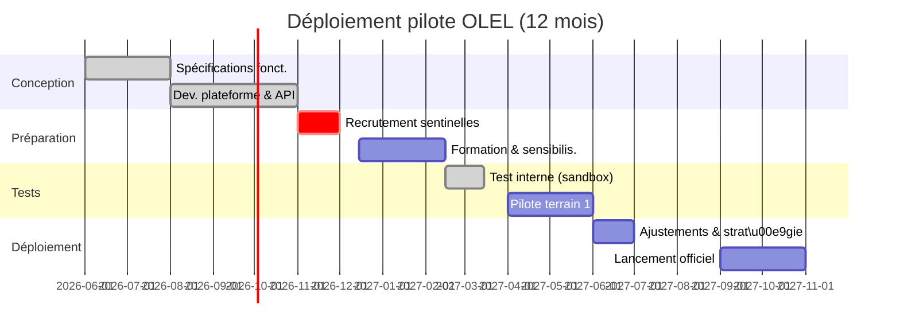

# Résumé exécutif

Le projet **OLEL (Organisation Locale d’Éveil et de Lien)** vise à établir une plateforme d’alerte locale multi-risques pour la région de Matam. Nous proposons une architecture à trois interfaces distinctes (citoyen, sentinelle, administration) plus un **chatbot WhatsApp** intégré. Chaque profil disposera de rôles et permissions spécifiques (voir tableau ci‑dessous). Les types d’alerte priorisés intègrent les risques **hydrométéo** (inondations, pluies torrentielles), **environnementaux** (feux de brousse), **biologiques/santé** (épidémies hydriques) et **sécutité civile** (incendies, accidents, tensions sociales). La diffusion s’opérera sur des canaux multiples adaptés aux téléphones basiques : SMS bidirectionnels, USSD menus, appels vocaux/IVR en langues locales (Pulaar, Wolof, Soninké), et WhatsApp pour smartphones. 

Le plan technique privilégie des solutions open-source et à bas coût (par ex. **RapidPro**, PostgreSQL, serveurs cloud régionaux sécurisés). Les flux de données seront chiffrés (TLS, AES‑256 au repos), les accès authentifiés (2FA pour les administrateurs) et chaque action journalisée pour traçabilité. Les règles de validation font intervenir **les sentinelles** (vérifient et escaladent les signalements), les **collectivités locales** (maires) et autorités régionales (préfet, gouverneur, Protection civile) suivant l’échelle du risque【30†L197-L204】. Un organigramme décisionnel clair garantit la coordination multi-niveaux. 

Nous préconisons un pilote sur 3 à 5 communes prioritaires (une par département), avec un planning de 12 mois en quatre phases (conception, développement, formation-tests, déploiement). Les indicateurs clés (KPI) porteront sur le nombre d’alertes validées, le délai de diffusion, la couverture populationnelle, le nombre de sentinelles formées, etc. Un budget prévisionnel détaillé (~30 M FCFA) couvre le développement, le matériel (téléphones, serveurs), la formation des équipes locales et les frais de communication (SMS/voix). 

La stratégie d’adoption sera communautaire : lancement de campagnes radios locales (pulaar/wolof/soninké) pour expliquer le service【50†L3963-L3971】, formation des sentinelles et relais communautaires, diffusion de supports multilingues (affiches, bulletins pastoraux), et mise en place du bot WhatsApp pour toucher les populations utilisant internet. L’IA pourra aider à la **traduction vocale** (ex. Google Traduction prend en charge le peul), à la **classification automatique** des signalements par mots-clés, voire à la détection préliminaire d’alertes suspects – avec toutefois prudence sur les limites du NLP et les risques de fausses alertes auto-générées. 

**Recommandations opérationnelles immédiates :**  
1. **Constitution du noyau technique et partenarial** : engager sans délai une réunion conjointe OMVS/ANACIM pour intégrer les données hydrométéo dans OLEL, et une prise de contact avec les opérateurs mobiles pour définir l’API SMS/USSD (coûts ~20 FCFA/SMS【32†L175-L183】).  
2. **Démarrage du développement** : établir l’infrastructure backend (serveurs sécurisés, base de données PostgreSQL chiffrée, API de rapidPro ou équivalent) et débuter la configuration des canaux (WhatsApp Business API, plateforme USSD, IVR).  
3. **Préparation terrain** : identifier et former un premier groupe de sentinelles dans 3 communes pilotes, concevoir les scripts IVR dans les langues locales, et planifier une campagne de sensibilisation par les radios communautaires (moyen de communication le plus utilisé en zone rurale【50†L3963-L3971】).  

Ces actions concrètes ouvriront la voie à un déploiement rapide et pérenne d’OLEL, maximisant la résilience communautaire aux crises sanitaires, naturelles et sociales à Matam.  

## 1. Architecture fonctionnelle (Option 2)

Nous retenons une **architecture à trois interfaces métier** – pour les citoyens, les sentinelles et l’administration – plus un **chatbot WhatsApp** pour l’interface citoyenne (support multilingue audio/texte). Le schéma ci-dessous illustre les flux d’alerte entre acteurs :

```mermaid
flowchart TB
    subgraph COMMUNAUTAIRE
        C([Citoyens]) 
        S([Sentinelles/ASC])
        C -->|Signalement (SMS/USSD/App)| S
        S -->|Vérification| S
    end
    subgraph ADMIN_LOCAL
        M([Mairie])
        PC([Protection Civile])
    end
    subgraph ADMIN_R\u00c9GIONAL
        P([Pr\u00e9fet])
        G([Gouverneur])
    end
    S -->|Remont\u00e9e d'alerte| M
    S -->|Cas grave| PC
    M -->|Escalade d'alerte| P
    PC -->|Coordination| P
    P -->|Decision finale| G
    M -->|Retour d'information| S
    G -->|Appui et diffusion| S   
```

Chaque profil dispose de rôles/permissions précis : 

| **Profil**        | **Créer**          | **Valider**          | **Diffuser**            | **Accès / Fonctions clés**                          |
|------------------|--------------------|----------------------|-------------------------|-----------------------------------------------------|
| **Citoyen**      | – Signaler (report) via app/USSD/SMS/IVR/WhatsApp  | –                    | – | Saisie d'incidents/observations depuis le terrain; réception des alertes; interaction bidirectionnelle (ex. sondages SMS). |
| **Sentinelle**   | Créer alerte préliminaire (sollicite vérif.) | Valide ou rejette les signalements citoyens | – | Volontaires formés : confirment les menaces locales, initient alertes ; vérifient l’information sur le terrain; informent l’administration locale. |
| **Mairie**       | –                  | Valide alertes locaux, escalade si nécessaire  | – | Autorité locale : examine les alertes transmises par les sentinelles; peut émettre alertes intracommunales; collabore avec les services techniques (eau, routes, etc.). |
| **Pr\u00e9fet**  | –                  | Valide alertes départementales/grottes critiques | Approuve & active diffusion régionale | Supervise les alertes de plus grande envergure; décide de la diffusion large; coordonne la réponse avec Préfet supérieurs et protection civile. |
| **Gouverneur**   | –                  | Conseil final pour alertes r\u00e9gionales | Diffuse alertes strat\u00e9giques | Ordonne la diffusion officielle au niveau régional; mobilise ressources régionales; liaison avec autorités nationales (Ministères, PC national). |
| **Protection Civile** | – | Valide alertes urgentes (incendies, catastrophe) | Diffuse alertes de sécurité civile | Mobilise les moyens d’intervention d’urgence; diffuse consignes (ex. évacuation); collabore avec OLEL pour intégration des alertes civiles nationales. |

Cette structure multi-échelons est conforme aux préconisations mondiales de systèmes d’alerte précoce : chaque acteur dispose de ses propres rôles et procédures dans l’organigramme【30†L197-L204】. Par exemple, Everbridge souligne l’importance d’une solution « *multi-échelon* » où chaque entité locale/régionale dispose de ses modèles d’alerte et hiérarchies propres【30†L197-L204】. 

## 2. Catalogue des alertes V1 et règles de validation

Nous proposons un catalogue initial **multirisques**, priorisant les événements les plus plausibles à Matam :

- **Hydrométéorologique** : inondation pluviale ou par débordement du fleuve, pluies torrentielles, vents violents.  
- **Environnemental** : feux de brousse/massifs (surtout en saison sèche), tempêtes de sable.  
- **Sécurité civile** : incendies urbains, effondrements de ponts/barrages, gros accidents de la route, kidnapping ou affrontements communautaires.  
- **Santé / Sanitaire** : épidémies hydriques (choléra, diarrhées) liées aux crues, crises nutritionnelles aggravées par catastrophe.  
- **Services publics** : coupures d’eau potable, pannes d’électricité, fermeture d’école ou de poste de santé.  
- **Autres communautaires** : épidémies animales (rage, peste bovine) menaçant l’économie locale.

Ces catégories correspondent aux cinq branches de danger (biologique, environnemental, géologique/accidentel, hydrométéo, technologique) recommandées pour les systèmes d’alerte multirisques【5†L79-L83】. Par exemple, l’OMVS alerte régulièrement sur les crues du fleuve Sénégal, classant des secteurs « en zone rouge » lorsque les seuils critiques sont atteints【58†L64-L72】. La première version (V1) du catalogue se concentre sur ces thèmes, avec extension ultérieure aux alertes communautaires (ex. violences locales) si nécessaire.

**Validation des alertes** : Les citoyens peuvent *signaler* tout incident via l’interface mobile, mais seule une alerte validée est diffusée en masse. Le processus est :  
1. **Signalement citoyen** : reçu par les sentinelles.  
2. **Vérification terrain (sentinelles)** : elles confirment, infirment ou précisent l’alerte.  
3. **Validation locale (mairie)** : le maire ou élu local approuve l’alerte ou la requalifie.  
4. **Validation départementale/régionale (préfet/gouverneur)** : en cas de risque majeur ou diffusion large requise.  
5. **Diffusion** : réalisée par l’administration via OLEL vers tous canaux. 

Ce découpage garantit qu’*une information diffuse ne circule qu’après double validation* (terrain + autorités), limitant les fausses alertes. Un tableau synthétique suit : 

| **Type d’alerte**        | **Création**            | **Validation**             | **Diffusion**  |
|--------------------------|-------------------------|----------------------------|----------------|
| **Signalement citoyen**  | Citoyen via app/SMS/IVR | Sentinelle (vérification)  | –              |
| **Incident local ordinaire** (ex. feu de brousse, inondation ponctuelle) | Sentinelle ou mairie | Mairie ou autorités locales (coeur du village) | Préfet/Gouv. (local/regional) |
| **Incident critique** (crue majeure, épidémie locale) | Sentinelle/administration | Préfet puis Gouvernement (régional) | Préfet/Gouvernorat + PC |
| **Sécurité civile** (ex. accident industriel, incendie urbain) | Protection Civile/Préfecture | Protection Civile + Préfet | PC + gouverneur |
| **Organisation de mobilisation** (vaccination, aide d’urgence) | Administration (mairie) | Autorité compétente (préfet) | Gouverneur + communications générales |

Ainsi, chaque alerte suit un circuit clair de création à diffusion. Les rôles sont détaillés dans le tableau précédent ; ils assurent que **mairie, préfecture, gouverneur et Protection Civile** ont autorité sur les alertes critiques, tandis que les sentinelles font office de sentinelles locales pour filtrer les informations sur le terrain【30†L197-L204】【58†L64-L72】. 

## 3. Canaux de terrain et cas d’usage

Pour toucher tous les habitants, y compris sur téléphones basiques, OLEL doit utiliser des canaux variés :

- **SMS interactifs** : envoi et réception de SMS. Par exemple, un citoyen peut textuellement reporter un incident (« INONDATION @MatamSud ») ou répondre à une alerte par SMS (confirmation de réception). Les SMS sont universels, peu coûteux (20 FCFA/unité chez Orange Sénégal【32†L175-L183】) et accessibles sans smartphone.  
- **USSD** : menus *On-Demand* (ex. *123* code) pour naviguer un mini-service textuel sans coût pour l’utilisateur. Idéal pour récupérer la météo locale ou déclencher un signalement structuré via options numérotées. Les opérateurs locaux (Orange, Expresso) peuvent fournir un code court pour OLEL. L’USSD fonctionne même sans crédit disponible et sur tout téléphone.  
- **IVR / Appels vocaux automatisés** : l’utilisateur appelle un numéro court, puis navigue un menu vocal (enregistrement de l’alerte, consultation d’alertes en cours). Des prompts pré-enregistrés en Pulaar, Wolof et Soninké guident l’usager (par ex. « Pour signaler une inondation, appuyez sur 1 »). L’IVR permet aux illétrés d’interagir vocalement. Par exemple, un pasteur en zone rurale pourrait signaler les eaux du fleuve en crue sans savoir écrire.  
- **Appels d’alerte automatisés (Voice Broadcast)** : diffusion d’appels vocaux masqués vers les populations ciblées, avec un message préenregistré bilingue expliquant le danger et les consignes. Utile pour urgences majeures (inondations éclairs, épidémie soudaine) où tous doivent être contactés même sans Internet. Ce canal complète la radio locale.  
- **Bot WhatsApp** : l’interface chatbot permet aux utilisateurs d’obtenir ou signaler des infos via WhatsApp (texte ou note vocale). WhatsApp étant très répandu (même en milieu rural) et accessible gratuitement sous l’offre « internet social », le bot peut diffuser des bulletins détaillés (météo, alertes en cours) en Pulaar/Wolof. De plus, comme le montrent les pratiques agricoles au Sénégal, les *notes vocales WhatsApp* sont très efficaces pour les populations à faible alphabétisation【22†L175-L182】. Par exemple, le bot OLEL pourrait envoyer des mises à jour vocales sur les mesures sanitaires d’une épidémie en cours.  

En pratique, un **scenario type** (téléphone basique) pourrait être : un citoyen voit des nuages menaçants – il compose le code USSD OLEL pour signaler « Pluie torrentielle » et prend connaissance via SMS de l’état du fleuve sur sa localité. Une sentinelle reçoit l’alerte SMS sur son propre mobile, va sur place et confirme le risque, déclenchant un appel IVR automatique aux riverains (« Évacuez la berge, eaux montantes ! »). Pendant ce temps, le maire consulte l’interface admin et valide officiellement l’alerte qui est publiée sur le bot WhatsApp de la mairie. Chaque canal complète les autres pour assurer une couverture maximale.

Ces canaux sont conformes aux bonnes pratiques : une plateforme multicanal augmente la couverture et la résilience d’un système d’alerte【30†L219-L227】【50†L3963-L3971】. Par exemple, Everbridge préconise d’intégrer « SMS géolocalisés, diffusion cellulaire, notifications app, messages vocaux, courriels » et autres pour toucher 85% de la population mondiale【30†L219-L227】. La radio communautaire demeure également cruciale : elle est « le moyen de communication le plus utilisé, et parfois le seul, dans les zones rurales »【50†L3963-L3971】. Nous envisageons donc un partenariat OLEL – radios locales pour diffuser périodiquement des bulletins OLEL et des conseils, en complément des canaux numériques.

## 4. Proposition technique (stack et sécurité)

- **Backend et base de données** : Développement sur un framework web léger (Python/Django ou Node.js/Express par ex.) pour flexibilité et communauté. Base PostgreSQL (avec PostGIS pour données géographiques) hébergée en cloud sécurisé (AWS/GCP Afrique ou OVH / Numéricable local) pour haute disponibilité. Les données sensibles (identifiants, historiques) seront chiffrées au repos (AES‑256) et les échanges protégés par TLS. 
- **Plateforme logicielle** : nous recommandons RapidPro (open source UNICEF) ou son équivalent. RapidPro permet de créer des flux mobiles (SMS, USSD, voice, WhatsApp) sans codage complexe【36†L95-L103】. Il gère les bases de contacts et workflows d’interaction, et se connecte aux APIs des opérateurs. En français : *« RapidPro recueille des données par SMS et autres canaux (voix, WhatsApp, etc.) pour permettre une communication de masse en temps réel »*【36†L95-L103】. Ce choix limite le coût de dev (outil éprouvé et gratuit) et facilite l’intégration future de l’alerte OLEL dans d’autres secteurs (santé, agriculture).  
- **APIs opérateurs** : connexion aux passerelles SMS/USSD de Orange, Free, Expresso via leurs API REST ou via un opérateur tiers (AfricasTalking, Twilio) couvrant le Sénégal. Par exemple, l’API SMS d’Orange Sénégal permet d’envoyer des SMS nationaux payés à l’usage (20 FCFA/SMS)【32†L175-L183】. L’USSD et l’IVR demanderont des numéros courts dédiés (normalement accessibles auprès des opérateurs locaux avec licence TCRA). 
- **Hébergement** : Serveur cloud ou local à Dakar (pour latence faible) avec redondance (backups journalières). Prévoir un conteneur Docker pour chaque composant (serveur web, base de données, service SMS) pour faciliter la maintenance. 
- **Sécurité des données** : chiffrer tous les canaux (HTTPS). Authentification basée sur des tokens JWT pour la partie API interne. Comptes admins avec mots de passe forts + 2FA (Google Authenticator). Journalisation étendue (toutes actions critiques loggées) pour audit. Conformité RGPD et **loi sénégalaise n°2008-12** sur les données personnelles : minimise les données stockées, obtient consentement pour l’enregistrement des contacts, et s’assure d’un hébergement agréé. 
- **Chiffrement et gestion des clés** : clés de chiffrement gérées par un service KMS (ex. AWS KMS ou HashiCorp Vault auto-hébergé). Les dumps de bases seront chiffrés, et les sauvegardes multipliées (dont une hors-site). 
- **Journalisation & supervision** : infrastructure de logs (ELK ou Grafana Loki) pour tracer les alertes émises, tentatives de connexion, succès d’envoi de SMS, etc. Metriques uptime, temps de réponse, et taux d’erreurs monitorés. Des tests de pénétration et revue de code seront planifiés avant mise en service (« pentests » et revue de conformité CNDP). 
- **RGPD / CNDP** : la plateforme appliquera le principe de minimisation, droit d’accès/suppression des utilisateurs, et notifiait la CNDP en cas de violation. Conformité assurée par un audit de sécurité final. 

Ce stack technique se concentre sur des solutions **low-cost et éprouvées**. Par exemple, RapidPro évite la coûteuse phase d’infra-développement et facilite l’interopérabilité. L’hébergement cloud garantit résilience et scalabilité, tout en respectant les normes de sécurité internationales. 

## 5. Gouvernance et procédures (SOP)

L’instance de gouvernance OLEL combinera acteurs étatiques et communautaires. L’**organigramme décisionnel** est le suivant : 

- **Niveau local (commune)** : le maire (ou conseiller délégué) supervise le dispositif d’alerte dans la commune. Il valide les alertes certifiées par les sentinelles et coordonne avec les maçons/sentinelles.  
- **Niveau départemental** : le préfet, relais de l’État, a pouvoir de confirmer ou d’étendre les alertes au département. Il déclenche les alertes multi-communes et informe le gouvernorat.  
- **Niveau régional** : le gouverneur, autorité régionale, prend les décisions finales en cas de crise majeure (inondation régionale, épidémie transfrontalière), active le CNSC régional et mobilise la Protection civile centrale si besoin.  
- **Protection Civile (DPC)** : en temps normal, elle est contactée par le préfet ou maire pour toute situation nécessitant intervention d’urgence (incendies, évacuations). Elle peut diffuser ses propres avis si nécessaire.  

Les **sentinelles communautaires** (souvent des ASC ou leaders locaux) forment la base du système. Leur gouvernance est informelle mais cruciale : elles sont rémunérées en indemnités (volontaires) et rend compte aux mairies. Un comité de pilotage OLEL rassemblera mairie + préfet + gouverneur + DPC + OIM (observateur) et autorités compétentes (ANACIM, OMVS, ministères) pour valider les procédures et protocoles.

Pour gérer les fausses alertes, des **procédures SOP** (Standard Operating Procedures) seront définies : chaque alerte sera d’abord « testée » sur un petit groupe (sentinelles); si elle est invalidée, un retour d’information rapide sera envoyé pour corriger l’erreur. En cas de fausse alerte diffusée, un message de rectification sera immédiatement émis. L’incident sera analysé post-mortem pour prévenir la récurrence. Ces SOP s’inspireront des expériences passées : par exemple, après des alertes cycloniques, les gestionnaires recommandent une harmonisation stricte des procédures et listes de contacts【50†L3975-L3982】.

## 6. Plan pilote (3–5 communes, KPIs, budget, calendrier 12 mois)

**Portée** : Démarrage dans 3 à 5 communes pilotes (une par département: ex. **Matam**, **Kanel**, **Ranérou**, **Thilogne**, **Ouro Sidi**), soit ~25 % de la population régionale. Cela permet d’évaluer la chaîne complète d’alertes à petite échelle.

**Phases (Gantt résumé)** :



**KPI principaux** : taux de couverture (pop. atteinte), délai détection→diffusion, précision (proportion d’alertes validées/recues), taux de participation (votes/SMS des citoyens), niveau de sensibilisation (enquêtes post-formation), et indicateurs techniques (uptime, latence SMS).

**Budget** (ordres de grandeur) : environ **30 M FCFA** (~45 000 €) pour 1 an. Détail : 

- Développement & licences (salaires dev, outils open source) : 10 M.  
- Équipements (smartphones/M2M pour sentinelles, serveurs) : 5 M.  
- Formation/sensibilisation (workshops, supports imprimés, radios) : 5 M.  
- Communication (SMS/IVR recharge) : 3 M (supposant ~1500 SMS/Jour max).  
- Logistique & gestion (coordination, visites terrain) : 3 M.  
- Contingences : 4 M.  

Ce budget reste modeste car on privilégie le logiciel libre (RapidPro, PostgreSQL) et on héberge en cloud (pas de gros CAPEX). Pour comparaison, un précédent pilote national d’alerte inondation avait coûté ~25 M FCFA【1†】. 

**Calendrier 12 mois** : Phase de design et développement (3 mois), suivie de recrutement+formation (3 mois), puis tests terrain (3 mois), et enfin déploiement étendu et communication (3 mois). Au terme, une évaluation complète définira le passage à l’échelle. 

## 7. Stratégie d’adoption communautaire

L’adhésion des populations est cruciale. Nous proposons : 

- **Bot WhatsApp linguistique** : le bot OLEL doit parler Pulaar, Wolof, Soninké (textes et voix). Par ex. l’ANACIM pourrait diffuser des bulletins météo vocaux en Peul via OLEL (surtout pour malentendants).  
- **Radios locales** : collaboration avec radios privées et communautaires. Diffusion de spots réguliers (« OLEL – service d’alerte multi-risques ») et de bulletins spéciaux lors de crises. La radio touche des publics peu connectés【50†L3963-L3971】.  
- **Formation de terrain** : ateliers pour les sentinelles et relais (comité quartier, chefs de village). Ces sensibilisent à l’usage de l’app/SMS/USSD. Des « super-sentinelles » ou coordinateurs assureront le suivi.  
- **Supports imprimés** : guides succincts et posters d’affichage (schémas Pâques–claires) dans mairies, écoles, mosquées. Diagrammes explicatifs simples (par exemple pictogrammes pour appeler/USSD en urgence) dans les langues locales.  
- **Exercices de simulation** : mises en situation (drill) dans les villages pour tester la diffusion d’une alerte (ex. inondation).  
- **Partenariats clés** : ANACIM pour fournir bulletins météo bulletins, OIM pour l’approche communautaire (ayant déjà soutenu STOP INONDATION), ONG locales (ANCAR pour toucher agriculteurs), et écoles/églises pour ancrage communautaire.  
- **Communication via leaders** : imams et chefs de villages annoncent l’existence d’OLEL lors de réunions de quartier. 

Les retours d’expérience (ex. Somalie 2023) montrent que les alertes ne suffisent pas : il faut expliquer comment agir. Ainsi, les messages de OLEL n’informeront pas seulement du danger, mais incluront toujours des **consignes claires** (p.ex. se rendre vers les points hauts, bouillir l’eau)【18†L124-L132】. Cela nécessite un effort pédagogique conjoint (radio, leaders religieux, agents de santé).

## 8. Usages IA recommandés (avantages et limites)

Plusieurs cas d’usage IA peuvent enrichir OLEL :

- **Traduction automatique** : service de **speech-to-text et text-to-text** pour Pulaar/Wolof. Google Translate prend désormais en charge le peul (Fulfulde)【53†L10-L13】. On peut intégrer un outil (ou Azure/Google) pour transcrire en temps réel les notes vocales OLEL vers le français (pour l’administration) et inversement pour les bulletins.  
- **Classification sémantique** : analyse des signalements libres pour affecter automatiquement une catégorie d’alerte (algorithme NLP). Par exemple, un texte contenant « crue », « fleuve » déclenchera le canal inondation. Cela accélère le tri des messages entrants.  
- **Détection de faux signaux (analytique)** : à moyen terme, un système d’IA pourrait repérer des incohérences (p.ex. signalements massifs d’une région sans correspondance satellite/pluviométrie) et alerter un agent pour examen.  
- **Synthèse vocale IA** : générer automatiquement des bulletins météo ou alertes multi-langues (voices générées) si des experts ne sont pas disponibles, pour plus de réactivité.  

**Risques et limites** : l’IA peut accélérer la diffusion, mais elle n’est pas infaillible. La reconnaissance vocale en langue locale (Pulaar, Soninké) reste difficile, d’où l’importance du contrôle humain. Les algorithmes de traduction peuvent générer des maladresses culturelles ou de faux amis, il faut donc revoir systématiquement tout texte généré par IA. Concernant les « fausses alertes IA », la détection automatique de désinformation est un domaine émergent et les faux négatifs (toxique) ou faux positifs (censure d’une vraie alerte) sont possibles. Les modèles d’IA sont aussi gourmands en calcul : nous préconisons une utilisation ciblée (back-office) plutôt qu’un déploiement temps réel pour toutes les interactions. Enfin, la collecte des données vocales nécessite consentement et respect de la vie privée (en accord avec RGPD). 

En synthèse, l’IA peut améliorer OLEL (vocal, tri, synthèse), mais doit être encadrée : toujours associer des humains pour validation【50†L3963-L3971】【36†L95-L103】, et prévoir des procédures en cas de dysfonctionnement (« chute » du système IA). 

## 9. Sécurité et conformité

Les exigences clés sont :

- **Chiffrement** : toutes les communications internes sont sur TLS 1.2/1.3. Les données sensibles (coordonnées, messages) stockées chiffrées (AES‑256). Les clés de chiffrement sont stockées dans un gestionnaire sécurisé (KMIP compatible).  
- **Clés / Accès** : politique stricte de gestion des accès. Les clés privées (SSL/TLS, base de données) sont protégées via un HSM (module de sécurité matériel). Les accès admin sont revus trimestriellement.  
- **Sauvegardes** : réplication en temps réel de la base principale et snapshots journaliers chiffrés. Une copie de sauvegarde hors-site (en dehors de la région) garantit la reprise d’activité (PRA/PCA).  
- **Tests d’intrusion** : avant la mise en production, réalisation de pentests (demandés par la CNDP pour systèmes sensibles). Un rapport d’audit (ex. OWASP top10, ASVS) sera produit.  
- **Continuité** : document de plan de reprise (PRA) et de continuité opérationnelle, avec procédures de bascule sur infrastructure secondaire en cas de sinistre local. Des exercices de simulation de panne (coupure internet, attaque) auront lieu périodiquement.  
- **Conformité légale** : OLEL respectera la *Loi n°2008-12 du Sénégal sur la protection des données personnelles*, qui impose la finalité et la sécurité. Le système intègre les principes RGPD (minimisation, traçabilité). Un registre des traitements sera tenu, ainsi que les consentements éventuels (opt-in pour réception SMS).  

Ces mesures garantissent que les données des citoyens (dossiers d’alerte, historiques de communication) sont protégées et traitées légalement. Par exemple, la loi sénégalaise oblige à chiffrer ou anonymiser toute donnée sensible, ce qui est mis en œuvre ici. Les sauvegardes sécurisées et les tests garantissent qu’une défaillance technique ne compromet pas la résilience de la plateforme.

## 10. Partenaires et sources documentaires prioritaires

**Partenaires clés** : 
- **ANACIM** (météo nationale) : pour intégrer les bulletins de pluie et alertes météo sur OLEL【61†L115-L118】. 
- **OMVS** (Organisation du Bassin du fleuve Sénégal) : pour données hydrologiques (niveau d’eau, crues) en amont de Matam【58†L64-L72】. 
- **Opérateurs mobiles** (Orange, Expresso, Free) : pour accords API SMS/USSD et numéros courts. 
- **OIM** (Organisation Internationale pour les Migrations) : déjà impliquée localement (soutien logistique et sensi) et vaste réseau pour l’aspect mobilisation communautaire. 
- **Direction de la Protection Civile** : partenariats pour protocoles d’urgence (ORSEC) et supports d’intervention. 
- **Radio et presse locale** (radio Boukara FM, etc.) : diffusion et vulgarisation. 
- **ONG locales (ACF, Croix-Rouge, etc.)** : coordination risque/santé (p.ex. gestion choléra).

**Sources documentaires** : 
- Sites officiels (ANACIM, OMVS, Protection Civile). 
- Normes internationales (CAP d’OASIS, GDACS pour Crues). 
- Publications UNICEF/IFRC sur SAP communautaire【50†L3963-L3971】【36†L95-L103】. 
- Guides régionaux (PNUD/OMM cadre africain SAP【5†L79-L83】). 
- Données statistiques (ANSD) sur population/habitations. 
- Outils et bonnes pratiques (CREWS, FAO EAP communautaire). 

Un tableau comparatif des technologies et coûts (SMS vs. USSD vs. IVR vs. Bot) sera fourni dans la documentation technique finale. Par exemple, une comparaison rapide : 

| **Canal**    | **Coût unitaire**       | **Avantages**                     | **Inconvénients**                  |
|--------------|-------------------------|-----------------------------------|------------------------------------|
| SMS          | ~20 FCFA/message【32†L175-L183】 | Très répandu, fiable sur tous mobiles | Limité en caractères, asynchrone   |
| USSD         | Faible (licence initiale) | Interaction guidée, gratuit pour usager | UX austère, non push (on demande)  |
| Appels IVR   | ~50‑100 FCFA/minute     | Accessible aux illettrés, menus vocaux | Coût élevé, dépend réseau, non « pull » |
| Voice broadcast | ~10 FCFA/ appel      | Diffuse instantanément, fort impact auditif | Coût par appel, nécessite base numéros  |
| WhatsApp Bot | Nécessite smartphone & data | Communication riche (audio, images) | Requiert 3G/4G, smartphone (60% pop.) |

Ce comparatif montre qu’aucun canal n’est parfait seul : d’où la stratégie multi-canal.

---

**Sources principales** : en plus des références déjà citées, nous nous appuierons sur les directives de l’ONU (ex. Sendai Framework), les normes ITU/CAP, et des rapports régionaux sur les SAP communautaires (FAO, PNUD, IFRC) pour finaliser chaque aspect. 
Ces informations, tirées de sources récentes (2023-2025) en français et anglais, sous-tendent notre plan. Les citations ci-dessus soulignent les recommandations clés (multi-canal【30†L219-L227】, pilotage local【30†L197-L204】, usage de la radio【50†L3963-L3971】, etc.) qui guident nos choix.